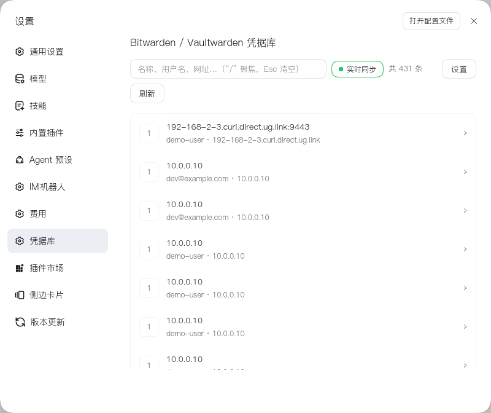
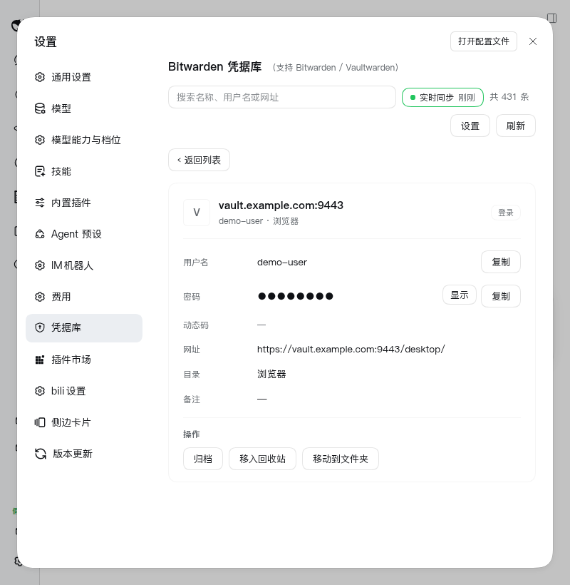
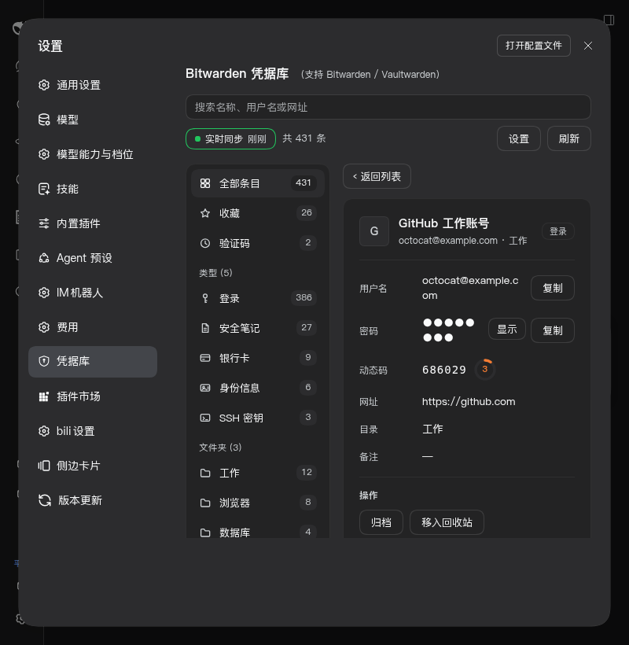

# dsh-vaultwarden — 让每个 DSH 会话实时同步 Vaultwarden 密码库

把自建 **Vaultwarden / Bitwarden** 接入 DeepSeek Harness：任何新建会话（无论 workspace）都会自动知道"密码可以去 Bitwarden 里读"；服务器端任何增删改都会通过 WebSocket **实时**反映到本地，无需手动刷新。

> **独立实现**：直接对接 Bitwarden/Vaultwarden 服务端 REST 与 SignalR 协议，不依赖 `bw` CLI，除可选的 `hash-wasm`（Argon2id KDF）外只用 Node 内置模块。
> 设计过程中参考了两个 MIT 项目，详见文末[「参考与致谢」](#参考与致谢)。

## 界面预览

| 条目列表 | 条目详情（浅色） | 条目详情（暗色） |
| --- | --- | --- |
|  |  |  |

> 截图中的条目为演示数据；界面颜色全部取自宿主的 `--dsw-alias-*` 主题 token，因此浅色/暗色下都跟随主题。

## 装了什么

| 能力 | 说明 |
| --- | --- |
| 实时同步引擎 | 登录后订阅 `/notifications/hub`（SignalR over WebSocket），服务器变更即时推送 → 400ms 防抖 → 增量 `/api/sync` + 解密换缓存；WebSocket 不可用（`ENABLE_WEBSOCKET=false`、旧服务器、反代不放行）自动降级为轮询，并**每 30–120 秒自动重试升级回 WebSocket**；429 限流自动退避 |
| 7 个全局工具 | `bitwarden_find`（检索，不含密码）、`bitwarden_get`（密码/用户名/TOTP/备注/自定义字段）、`bitwarden_status`（配置/连通/解锁/同步模式）、`bitwarden_sync`（强制同步）、`bitwarden_create`/`bitwarden_update`/`bitwarden_delete`（写回，默认关闭） |
| 系统提示词章节 | 全局注入引导：需要任何账号、密码、API key、token 时先自查凭据库，而不是先问用户 |
| 配置表单 | 由宿主从插件 `Config` schema 派生（设置 → 插件 → bitwarden）：9 个字段（服务器/邮箱/主密码/API 密钥/同步选项/权限档），密钥字段为只写 |
| 条目浏览面板 | 设置 → 凭据库 独立页面：搜索、列表、详情、复制、TOTP 30 秒倒计时、reprompt 条目受保护；同步徽标**可点击手动同步**，悬停显示模式/连接/间隔/上次同步/错误 |
| 认证通道 | 面板经 `/api` connection RPC 取数（`vw/*` 命名空间）——**走操作者已认证会话**，插件不自建 HTTP 路由 |

插件直连服务器 REST API（`/identity/accounts/prelogin`、`/identity/connect/token`、`/api/sync`、`/api/ciphers*`），
**不依赖 `bw` CLI**；除可选的 `hash-wasm`（Argon2id KDF）外全部使用 Node 内置模块。

## 配置

三种方式，优先级从高到低：**用户设置（GUI/settings.yaml）→ 插件组合配置 → 环境变量 → 默认值**。

### 1. DSH 设置界面（推荐）

**设置 → 插件 → 插件配置 → Bitwarden / Vaultwarden 凭据库**：主密码与 API 密钥是**只写字段**（保存后不回传浏览器，留空表示不修改）。

| 字段 | 说明 |
| --- | --- |
| `serverUrl` | 服务器地址，如 `https://vault.example.com` 或 `http://192.168.x.x`（留空则插件待配置，不报错） |
| `email` | 登录邮箱。**必须与账号一致**——它是 KDF 的盐值 |
| `masterPassword` | 主密码（secret）。用于派生主密钥、解密保险库，只存本机 `settings.yaml` |
| `apiKeyClientId` / `apiKeyClientSecret` | 可选。Bitwarden 网页端 → 账户设置 → 安全 → 密钥；填了走 API 密钥登录，**可绕过两步验证** |
| `websocket` | 启用 WebSocket 实时通知（默认开） |
| `pollIntervalSeconds` | WebSocket 不可用时的兜底轮询间隔（默认 300 秒，最小 30）。WebSocket 正常时用不到，徽标可点击手动同步 |
| `cacheMinutes` | 解锁后的内存缓存时长（默认 30 分钟） |
| `deviceIdentifier` | 可选设备标识。官方桌面/浏览器客户端会持久化稳定值；**留空按「服务器+邮箱」确定性派生，不写盘** |
| `accessMode` | 写权限：`readonly`（默认，一律拒绝写回）/ `ask`（每次写回需用户确认）/ `auto`（直接写回）。仅个人条目，组织条目明确报错 |
| `sessionDays` | 登录会话保留天数（默认 30，0=每次重登）。**按闲置计时**：期间只要用过一次就自动续期，闲置超期才失效 |

### 2. 环境变量

`DSH_BITWARDEN_SERVER`、`DSH_BITWARDEN_EMAIL`、`DSH_BITWARDEN_MASTER_PASSWORD`、
`DSH_BITWARDEN_CLIENT_ID`、`DSH_BITWARDEN_CLIENT_SECRET`、`DSH_BITWARDEN_DEVICE_ID`（也接受去掉 `DSH_` 前缀的写法）。

### 3. 组合配置

profile 的 cordis 配置里给插件传入同名字段即可。

## 用法（模型侧）

```
bitwarden_find  { "query": "github" }                  → 条目列表（元信息，无密码）
bitwarden_get   { "id": "…", "field": "password" }     → 用户名 + 密码
bitwarden_get   { "name": "GitHub 工作账号", "field": "totp" } → 当前动态码
bitwarden_status{ "refresh": true }                    → 状态报告（含 liveSync: 模式/连接/最近同步）
bitwarden_sync  { }                                    → 强制重新同步
bitwarden_create{ "name": "新站点", "username": "…", "password": "…" } → 写回（需 accessMode=ask/auto）
bitwarden_update{ "id": "…", "password": "新密码" }     → 改密（需 accessMode=ask/auto）
bitwarden_delete{ "id": "…", "permanent": false }      → 软删/彻底删（需 accessMode=ask/auto）
```

## 用法（人侧）

**设置 → 凭据库**（左栏新增入口）：搜索框（`/` 聚焦、Esc 清空、↑↓ 选择）、条目列表（首字母头像/用户名/URI/收藏/TOTP 徽标）、详情（密码默认掩码可切换、复制按钮、TOTP 倒计时进度条、备注/自定义字段/目录）。Bitwarden 里开了「重新验证」的条目不会自动出明文，需点「确认读取」。

## 对 Bitwarden/Vaultwarden 客户端约定的遵从

- **设备标识**：按「服务器+邮箱」确定性派生（可配置覆盖），不像官方 CLI 那样每次登录新建设备。
- **通知类型**：按官方 `NotificationType` 枚举处理——`LogOut`（会话在别处被注销）会清除本地令牌与缓存，其余类型触发重同步。
- **SignalR 协议**：negotiate → WebSocket（`access_token` 走 query）→ `{"protocol":"json","version":1}` 握手 → type 6 keepalive 应答 → type 1 ReceiveMessage。
- **reprompt**：`reprompt: 1` 的条目不自动返回明文（工具与面板同一规则，`confirm` 才读）。
- **回收站语义**：软删（`deletedDate`）后的条目不进入列表，可 restore；彻底删除走 purge。
- **per-item key**：写回时按官方做法生成 64 字节条目密钥，字段用条目密钥、`cipher.key` 用用户密钥包裹（类型 2 EncString）。
- **限流**：429 时按官方客户端的退避思路重试一次。

## 安全说明

- 主密码、用户密钥、解密后的条目**只存在内存**，不写盘、不打日志；插件只持久化用户填写的配置。
- 配置表单由宿主从插件 `Config` schema 派生（设置 → 插件 → bitwarden）；面板数据走 `/api` connection RPC（已认证会话），**没有绕过鉴权的自建路由**。
- 工具返回的明文凭据会进入会话上下文（这是"让模型能用密码"的前提）。提示词要求模型不要回显、不要写入文件。
- 写回默认关闭（`accessMode: readonly`）；`ask` 档每次写入都走 DSH 审批确认，`auto` 直接写入。两者都只能写个人条目，组织条目明确报错。
- 与本地 `dsh-vault` 插件**无标识冲突**（条目 id / 工具名 / 设置命名空间 / 设置页 id 均不同）：本插件是 `dsh-vaultwarden` ↔ `bitwarden_*` ↔ `bitwarden` ↔ `vaultwarden`，dsh-vault 是 `vault` ↔ `vault_*` ↔ `settings.vault` ↔ `vault`。

## 排错

| 现象 | 处理 |
| --- | --- |
| `凭据库尚未配置完整` | 在设置卡片补 `serverUrl` + `email` + `masterPassword`（或 API 密钥） |
| 面板停在「尚未配置完成」、只有「重试」按钮 | 0.2.1 及更早的全新安装会如此（`vw/config` 被 `sessionPersistence` 拖垮）。升级到 0.2.2，或先在 设置 → 插件 → dsh-vaultwarden 的配置卡片里手填三项，面板随即恢复 |
| `登录失败：Username or password is incorrect` | 核对 `email`（必须与登录账号一致）与主密码 |
| `该账户启用了两步验证` | 改用 API 密钥登录（client_id/client_secret） |
| `该账户使用 Argon2id KDF` | 插件目录执行 `npm install hash-wasm`；或网页端把 KDF 改为 PBKDF2-SHA256 |
| `无法连接 …` | 检查地址/端口/证书与网络可达性；自签证书需换成受信任证书 |
| 实时同步不生效 | `bitwarden_status` 看 `liveSync.mode`：`polling` 说明 WebSocket 没通（反代需放行 `Upgrade`/`Connection`，或服务器 `ENABLE_WEBSOCKET=false`） |
| 想让模型立刻重试 | `bitwarden_status { "refresh": true }` 或 `bitwarden_sync` |

## 安装

```sh
dsh plugin --profile web add dsh-vaultwarden          # npm（发布后）
dsh plugin --profile web add github:<owner>/dsh-vaultwarden#v0.2.2   # GitHub 源（首次需 allowBuilds）
dsh plugin --profile web add /absolute/path/to/dsh-vaultwarden        # 本地路径（开发）
```

装新 bundle 后可能需要重启 `dsh web` 才会加载；前端半边在页面刷新后出现。

## 测试

```sh
bash scripts/build.sh    # 链接 peer 依赖 + 语法检查 + 七套离线测试（共 214 项）
```

| 套件 | 覆盖 |
| --- | --- |
| `test/mock-e2e.test.mjs`（38） | 协议 / 加密 / 检索 / TOTP / 令牌刷新 / API key / 两步验证 |
| `test/live-sync.test.mjs`（17） | WebSocket 握手 / 推送同步 / 防抖 / LogOut / 降级轮询 / 升级回退 |
| `test/mutations.test.mjs`（22） | 写回增改删恢复 + per-item key 往返 |
| `test/host-entry.test.mjs`（21） | Host 入口 `apply()` + Remote 网关线面（含 SRC 签名约束） |
| `test/gateway-flow.test.mjs`（30） | 登录全链路：错密码 / 2FA 挑战 / 换码重试 / 会话持久化 |
| `test/access-mode.test.mjs`（16） | readonly / ask / auto 三档权限 |
| `test/client-card.test.mjs`（63） | 条目面板 + 徽标手动同步 + 重开缓存（react-test-renderer + RPC 桩） |

mock 服务端（`test/mock-server.mjs`）按 Bitwarden 协议实现了服务端半边（PBKDF2/Argon2id、HKDF、AES-CBC+HMAC、per-item key、组织密钥、SignalR hub、两步验证），可选取代官方 `bw` CLI 做跨实现对照。设计说明见 [docs/ui-design.md](docs/ui-design.md)。

## 登录与会话

### 为什么要输两次（密码 + 验证码）

Vaultwarden 的两步验证是**两步**：先验证主密码，再提交动态码。插件严格按这个顺序来——密码错误会停在表单并报错，**只有密码验证通过后**才进入验证码界面。

### 免密登录（推荐）

`sessionDays` 默认 **30 天**，且**按闲置计时**：登录一次后，令牌（含 refresh token 与派生主密钥）会加密保存在 `~/.dsh/data/dsh-vaultwarden/session.json`（权限 `0600`，仅本人可读）。期间只要用过一次密码库，有效期就自动往后滑；**闲置超过 30 天才失效**。所以正常情况下，插件重启、DSH 重启都不需要你再输密码——除非真的 30 天没用过。

设为 `0` 可关闭持久化，每次都重新登录。

> ⚠️ 该文件等同于主密码的保护级别：能读到它就能解密保险库。这与插件已把 `masterPassword` 存在 profile 配置里（为了能无人值守解锁）是同一权衡，官方客户端的「记住我 / PIN 解锁」也是同样取舍。

### 通行密钥（passkey / WebAuthn）不支持

Vaultwarden 的通行密钥是一种 **2FA 方式**，但它必须由**浏览器调用 `navigator.credentials` 并配合认证器上的用户手势**（指纹/面容/PIN）才能完成——这是 WebAuthn 防自动化的核心设计。插件运行在无头 Node 进程中，**没有浏览器和认证器，物理上无法完成这个仪式**，因此不支持，未来也不会支持。

**替代方案**：改用 **API 密钥**登录（`apiKeyClientId` = `user.<uuid>` + `apiKeyClientSecret`）。Vaultwarden 的 API 密钥**直接绕过 2FA**（服务端 `user_api_key_login` 不调用 `twofactor_auth`），配合上面的会话持久化，基本可以做到永久免密。

在面板的登录表单里把「登录方式」切到 **API 密钥**即可填写这两个字段（宿主的插件配置页同样可以填）。密钥在 Vaultwarden 网页端 **设置 → 安全 → 密钥** 获取。

> 注意：API 密钥只解决**登录**，不解决**解密**——保险库是用主密码派生的密钥加密的，所以 `masterPassword` 仍然必填。API 密钥省掉的是验证码，不是主密码。

## 参考与致谢

本项目为独立实现，设计与实现过程中参考了以下两个 MIT 项目：

| 项目 | 本项目参考之处 |
| --- | --- |
| [Jindom/dsh-bitwarden](https://github.com/Jindom/dsh-bitwarden) | DSH 凭据插件的最小骨架、系统提示词注入思路、mock 服务端测试方法论 |
| [Ox0400/dsh-vault](https://github.com/Ox0400/dsh-vault) | `--dsw-alias-*` 主题 token 用法、设置页面板的视觉与交互基线 |

在此致谢。两者的 MIT 许可与版权声明见 [THIRD-PARTY-NOTICES.md](THIRD-PARTY-NOTICES.md)。

## 许可

MIT，详见 [LICENSE](LICENSE)。
